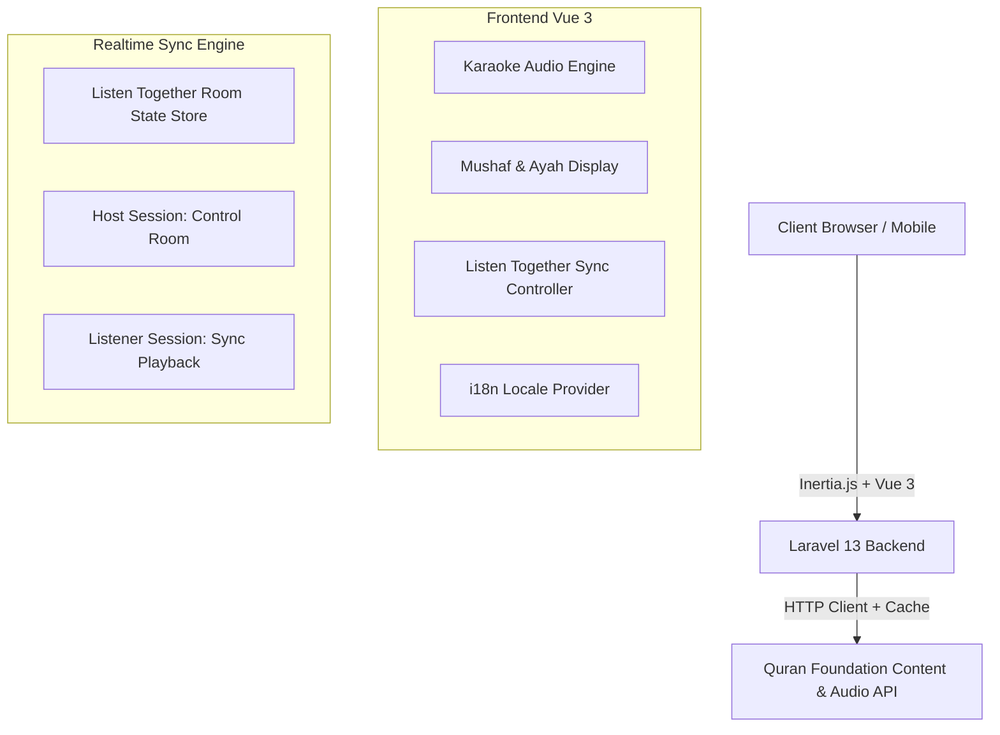
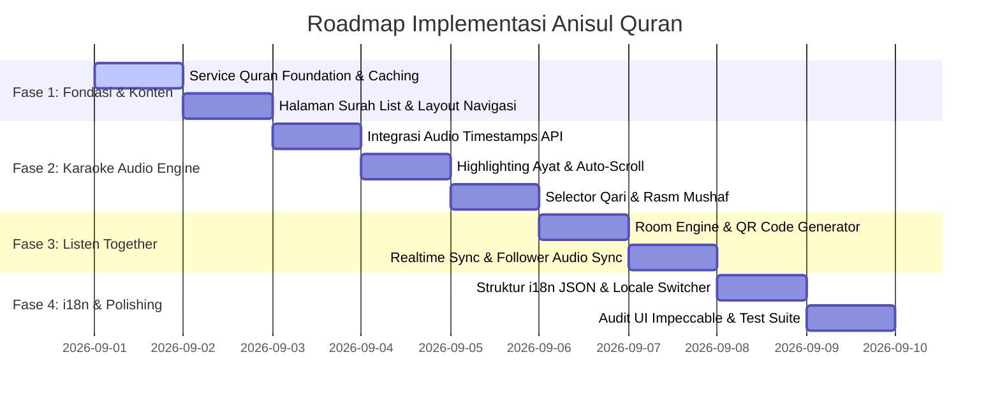

# 📖 Anisul Qur'an - Master Project Planning

> **Visi Proyek**: Aplikasi pembaca dan pemutar audio Al-Qur'an interaktif dengan visualisasi ala **"Karaoke Sync"** (ayat, transliterasi, dan terjemahan menyala mengikuti lantunan qari), serta fitur unggulan **"Listen Together"** (sinkronisasi mendengarkan bersama secara *real-time* antar-perangkat via scan QR Code).

---

## 🎯 1. Tujuan & Karakteristik Utama (Scope v1.0)

1. **Tanpa Autentikasi / Tanpa Login (Zero-friction)**:
   - Pengguna langsung bisa membuka aplikasi, memilih Surah/Ayat, memilih Qari, dan memutar audio tanpa hambatan registrasi/login.
2. **Karaoke-Style Audio-Visual Highlighting**:
   - Teks Arab, transliterasi Latin, dan terjemahan Bahasa Indonesia otomatis tersorot (*highlighted*) dan di-*scroll* secara dinamis dan halus sesuai posisi stempel waktu (*timestamps*) bacaan qari.
3. **Kustomisasi Preferensi Bacaan**:
   - **Pilihan Qari / Reciter**: Bebas memilih qari favorit kelas dunia (Mishary Rashid Alafasy, Al-Husary, AbdulBaset, As-Sudais, Al-Ghamdi, dll.).
   - **Pilihan Mushaf / Rasm**: Teks Uthmani Hafs (Madinah), IndoPak (Naskh Asia Tenggara), dan Tajweed berwarna.
   - **Terjemahan**: Terjemahan resmi Bahasa Indonesia (Kemenag RI) dengan opsi ukuran font teks Arab dan terjemahan yang dapat diatur.
4. **Arsitektur Siap Internationalization (i18n)**:
   - Default Bahasa Indonesia untuk antarmuka aplikasi.
   - Struktur kamus terisolasi dalam file `.json` (`locales/id.json`, `locales/en.json`, `locales/ar.json`) agar mudah menambah bahasa lain di masa depan.
5. **🌟 Fitur Unggulan: "Listen Together" (Real-time Multi-Device Sync)**:
   - **Host Mode**: Perangkat utama yang memulai sesi mendengarkan bersama.
   - **QR Code & Share Link Generator**: Host mengaktifkan mode *Listen Together*, menghasilkan kode QR dan tautan instan.
   - **Listener / Follower Mode**: Perangkat lain (misal: HP, tablet, atau teman di laptop lain) cukup scan QR code dan langsung mendengarkan surah/ayat yang persis sama.
   - **Role Separation**:
     - **Host**: Memiliki kontrol penuh (*Play, Pause, Seek, Ganti Surah, Lompat Ayat, Ganti Qari*).
     - **Listener**: Mode pengikut (*follower*) — audio dan tampilan ayat bergerak secara otomatis mengikuti komando Host tanpa tombol pause/skip lokal.

---

## 🏗️ 2. Arsitektur Teknis



### Stack Teknologi:
- **Backend**: Laravel 13 (PHP 8.3+)
  - `QuranFoundationService`: Integrasi resmi API Quran Foundation dengan sistem *smart caching* (Redis/Database/File) agar panggilan API cepat & hemat kuota.
  - `ListenTogetherController`: Manajemen Room Session dan endpoint sinkronisasi state.
- **Frontend**: Vue 3 (Composition API, `<script setup>`) + Inertia.js v3
  - **Styling**: Tailwind CSS v4 + **shadcn-vue** (komponen dialog, slider, select, dropdown, tooltip, badge, card, sheet).
  - **Design & UX**: Mengikuti standar **Impeccable** (hierarki visual elegan, kontras ramah mata, tipografi autentik Arab & Latin, dark mode estetik).
- **Audio Engine**:
  - HTML5 Web Audio API dengan event loop presisi tinggi untuk pencocokan millisecond timestamp ayat/kata.
- **Testing**:
  - **Backend**: Pest PHP 5 (Feature & Unit tests).
  - **Frontend**: Vitest + `@vue/test-utils` + `happy-dom`.

---

## 🧩 3. Rincian Modul & Komponen

### A. Modul Quran Audio & Karaoke Engine
- **`QuranReader.vue`**: Komponen utama pembaca Al-Qur'an (Infinite scroll / Paginated / Surah view).
- **`AyahItem.vue`**: Menampilkan nomor ayat, teks Arab dengan rasm terpilih, tombol putar per ayat, transliterasi Latin, dan terjemahan Kemenag.
- **`AudioPlayerBar.vue`**: Floating player bar di bagian bawah layar:
  - Play/Pause, Progress Bar, Next/Prev Ayah, Speed Selector (0.75x, 1x, 1.25x, 1.5x), Repeat Mode (Repeat Ayah / Repeat Surah).
  - Indikator Surah & Qari yang sedang aktif.
  - Tombol aksi *"Listen Together"*.
- **`ReciterSelectorModal.vue`**: Modal pencarian dan pemilihan Qari dengan preview suara singkat.
- **`SettingsDrawer.vue`**: Pengaturan ukuran font Arab, pilihan rasm Mushaf, toggle terjemahan/transliterasi, dan tema (Dark/Light/Sepia).

### B. Modul "Listen Together" (Real-time Sync)
- **Room State Contract**:
  ```json
  {
    "roomId": "anisul-8f3a",
    "hostDeviceId": "uuid-v4",
    "surahId": 2,
    "ayahNumber": 100,
    "currentTimestampMs": 142500,
    "status": "playing",
    "reciterId": 7,
    "mushafType": "uthmani",
    "lastHeartbeat": 1788253000
  }
  ```
- **Komponen**:
  - **`ListenTogetherModal.vue`**: Menampilkan QR Code (menggunakan library generator QR SVG), link copy, dan status jumlah listener yang terhubung.
  - **`SyncDriftCorrector`**: Algoritma client-side untuk mencocokkan waktu audio listener dengan host secara halus tanpa suara tersendat (*smooth audio time seeking*).
  - **`FollowerBanner.vue`**: Banner floating di perangkat listener: *"Mengikuti Sesi: [Nama Host] — Mode Mendengarkan Bersama"*.

### C. Modul Internationalization (i18n)
- File kamus di `resources/js/locales/`:
  - `id.json`: Terjemahan UI Bahasa Indonesia (Default).
  - `en.json`: Terjemahan UI Bahasa Inggris.
- Helper reaktif `useI18n()` / `$t('player.listen_together')` untuk rendering teks dinamis tanpa perlu reload halaman.

---

## 🗺️ 4. Roadmap & Milestone Implementasi



### **Fase 1: Backend Service & Halaman Surah**
- [ ] Buat `App\Services\QuranFoundationService` untuk mengambil 114 Surah, data Ayat, Terjemahan Kemenag, dan Audio timestamps.
- [ ] Buat `SurahController` & Halaman `resources/js/Pages/Surah/Index.vue` (Daftar 114 Surah dengan fitur filter pencarian cepat, info tempat turun, jumlah ayat).
- [ ] Buat Halaman `resources/js/Pages/Surah/Show.vue` (Tampilan ayat lengkap).

### **Fase 2: Karaoke Audio Player & Visual Highlighting**
- [ ] Buat composable `useQuranAudioPlayer.js` yang mengelola audio stream, progress, dan event timestamps.
- [ ] Buat sistem active ayah highlighting & smooth auto-scrolling mengikuti audio.
- [ ] Buat selector Qari dan switch rasm font (Uthmani vs IndoPak).
- [ ] Buat unit test frontend untuk audio state dan helper.

### **Fase 3: Fitur Unggulan "Listen Together"**
- [ ] Buat backend `ListenTogetherController` (Create Room, Join Room, State Sync polling/broadcast, Heartbeat).
- [ ] Buat modal QR Code generator di host device.
- [ ] Buat halaman/mode Listener (`/listen/:roomId`) yang otomatis mengunci kontrol dan menyamakan audio position dengan Host.
- [ ] Uji sinkronisasi multi-device di browser desktop & mobile.

### **Fase 4: i18n, UI Polish (Impeccable) & Verifikasi**
- [ ] Setup `locales/id.json` & `locales/en.json` untuk semua string teks UI.
- [ ] Audit desain dengan `npx impeccable detect resources/js/` (memastikan kontras warna, tipografi, dan responsivitas mobile optimal).
- [ ] Tulis Feature Test Backend (Pest) dan Component Test Frontend (Vitest).
- [ ] Tag release milestone `v0.2.0`.

---

## 🔒 5. Prinsip Keamanan & Performa
1. **API Caching**: Semua data statis (teks surah, terjemahan, daftar qari) di-cache di Laravel agar aplikasi tetap instan dan tidak membebani server Quran Foundation.
2. **Audio Preloading**: Audio ayat berikutnya di-preload secara pintar di browser agar pergantian ayat terdengar tanpa jeda (*gapless audio playback*).
3. **No Private Leak**: Seluruh panggilan API eksternal melewati backend Laravel; kredensial dan URL rahasia tetap aman di `.env`.
