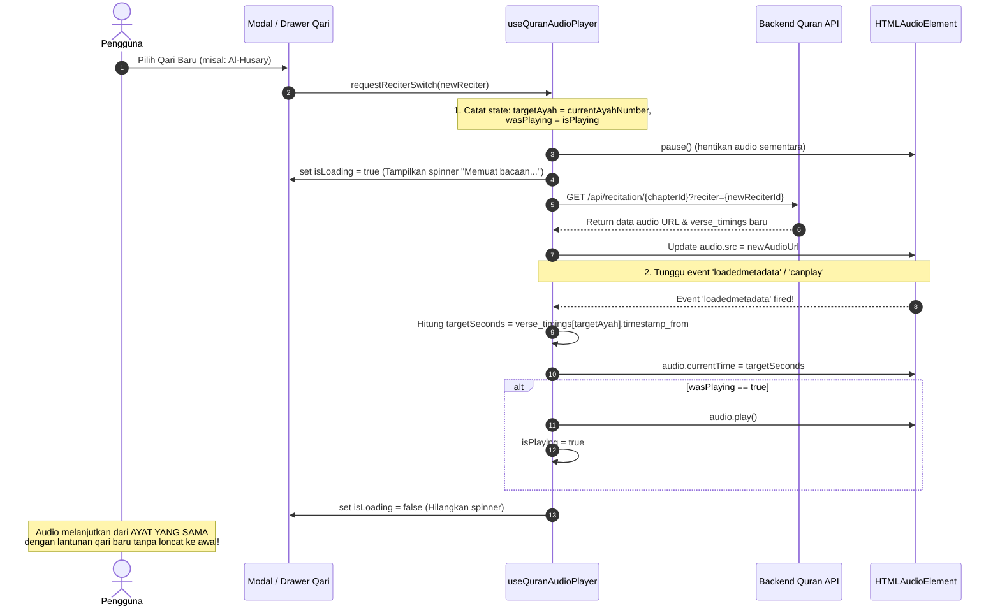

# 📝 Catatan Diskusi Teknis, Arsitektur & Rencana Fitur (.agents/catatan.md)

> Dokumen ini merangkum analisis mendalam, keputusan arsitektur, catatan bug, dan rancangan fitur strategis untuk pengembangan aplikasi **Anisul Qur'an**.

---

## 📑 Daftar Isi
1. [Dilema Fitur Preferensi: Per-Surah vs Global](#1-dilema-fitur-preferensi-per-surah-vs-global)
2. [Fitur Dengar Bersama: Batasan Preferensi Host vs Listener](#2-fitur-dengar-bersama-batasan-preferensi-host-vs-listener)
3. [Analisis Bug Perubahan Qari & Penanganan Transisi di Tengah Surah](#3-analisis-bug-perubahan-qari--penanganan-transisi-di-tengah-surah)
4. [Next Major Feature: Mode Tadabbur Alam (Cinematic Quran Sanctuary)](#4-next-major-feature-mode-tadabbur-alam-cinematic-quran-sanctuary)
5. [Rencana Fitur Mayor Tambahan: Surah Qari Bookmark & Override (Opsi C)](#5-rencana-fitur-mayor-tambahan-surah-qari-bookmark--override-opsi-c)

---

## 1. Dilema Fitur Preferensi: Per-Surah vs Global

### 🔍 Konteks Permasalahan
Saat membaca atau mendengarkan Al-Qur'an, preferensi pengguna meliputi:
- **Pilihan Qari** (misal: Mishary Rashid Alafasy, Al-Husary, AbdulBaset, As-Sudais, dll.)
- **Pilihan Mushaf/Rasm** (Uthmani Hafs Madinah vs IndoPak Naskh)
- **Ukuran Font** (Teks Arab & Terjemahan)
- **Tampilan Elemen** (Toggle Terjemahan Kemenag & Transliterasi Latin)
- **Mode Baca** (Mode Per-Ayat vs Mode Mushaf Fisik vs Mode Khusyu')

Muncul pertanyaan mendasar: **Apakah preferensi ini harus disimpan secara Global (berlaku ke semua 114 Surah) atau Per-Surah (setiap surah memiliki setting unik tersendiri)?**

---

### ⚖️ Analisis Perbandingan & Trade-offs

| Aspek | Opsi A: Full Global (Kondisi Saat Ini) | Opsi B: Full Per-Surah | Opsi C: Hybrid / Smart Override (Rekomendasi) |
| :--- | :--- | :--- | :--- |
| **Pilihan Qari** | 1 Qari terpilih berlaku untuk semua surah yang dibuka. | Tiap surah mengingat qari terakhir yang diputar di surah tersebut. | **Global Default** untuk semua surah, dengan opsi opsional: *"Ingat Qari ini khusus untuk Surah ini"*. |
| **Ukuran Font & Tampilan** | Ukuran font & toggle Latin/Terjemahan seragam di seluruh aplikasi. | Pengguna bisa mengatur font beda di surah pendek vs panjang. | **Full Global**: Pengaturan visual (font, terjemahan, tema) wajib seragam agar konsisten dan nyaman di mata. |
| **Mental Model Pengguna** | Sangat mudah diprediksi. Pengguna tidak kaget dengan setting yang berubah-ubah. | Membingungkan (*Cognitive friction*): Pengguna lupa setting apa yang pernah dipilih di surah yang sudah lama tidak dibuka. | Jelas dan intuitif: Pengguna tahu ada setelan utama, dan tahu kapan mereka secara sengaja mengunci qari tertentu. |
| **Beban Storage & State** | Sangat ringan, hanya 1 objek preferensi di `localStorage` (~1 KB). | Berpotensi bloat (114 keys x berbagai preferensi), rentan migrasi data yang rapuh. | Ringan: Menyimpan 1 objek preferensi global + 1 dictionary mapping kecil `reciterOverrides: { "55": 4, "18": 7 }`. |

---

### 💡 Keputusan Saat Ini: **Opsi A (Full Global) Paling Optimal**

Berdasarkan evaluasi kepraktisan, pengalaman pengguna (*user experience*), dan kesederhanaan arsitektur:
1. **Keputusan Saat Ini:** **Opsi A (Full Global)** adalah solusi yang paling optimal dan diterapkan saat ini:
   - **Pengaturan Visual (100% Global):** Ukuran font Arab & Latin, transliterasi Latin, terjemahan Kemenag, jenis Rasm (Uthmani/IndoPak), dan tema suasana Vibe (Noor, Midnight, Warqah) seragam di seluruh 114 surah. Pengguna membaca dengan mata dan perangkat yang sama sehingga konsistensi visual sangat penting agar tidak menimbulkan kelelahan membaca (*reading fatigue*).
   - **Pilihan Qari (Global Default):** 1 Qari terpilih berlaku untuk semua surah agar alur pemutaran mudah diprediksi (*predictable mental model*), tidak membingungkan pengguna (*zero cognitive friction*), dan penyimpanan di `localStorage` tetap sangat ramping (< 1 KB).
2. **Rencana Fitur Mayor Mendatang:**
   - Ide **Opsi C (Arsitektur Hybrid / Surah Qari Bookmark)** disepakati untuk ditunda dan dijadwalkan sebagai fitur mayor lanjutan di masa mendatang (lihat rincian spesifikasi di **[Bagian 5: Rencana Fitur Mayor Tambahan: Surah Qari Bookmark & Override](#5-rencana-fitur-mayor-tambahan-surah-qari-bookmark--override-opsi-c)** di bawah Mode Tadabbur Alam).

---

## 2. Fitur Dengar Bersama: Batasan Preferensi Host vs Listener

### 🔍 Pertanyaan Kunci
> *"Di fitur Dengar Bersama (Listen Together), apakah preferensinya harus sama dengan host?"*

Jawabannya adalah **TIDAK SEMUANYA SAMA**. Kita harus memisahkan secara tegas antara **Shared Playback Engine (Wajib Sinkron)** dan **Personalized Local Presentation (Wajib Independen)**.

```
┌─────────────────────────────────────────────────────────────┐
│                 FITUR DENGAR BERSAMA (ROOM)                 │
├──────────────────────────────┬──────────────────────────────┤
│    SHARED ENGINE (SAMA)      │   LOCAL PRESENTATION (BEDA)  │
│   (Wajib Mengikuti Host)     │  (Hak Masing-Masing Listener)│
├──────────────────────────────┼──────────────────────────────┤
│ • Qari / Reciter ID          │ • Volume Audio & Mute Lokal  │
│ • Surah (Chapter ID)         │ • Ukuran Font Arab & Latin   │
│ • Posisi Ayat (Current Ayah) │ • Pilihan Rasm (Uthmani/Indo)│
│ • Audio Timeline & Drift     │ • Toggle Terjemahan & Latin  │
│ • Play / Pause State         │ • Suasana Vibe & Dark/Light  │
│ • Seek Jump Command          │ • Mode Baca (Ayat vs Khusyu) │
└──────────────────────────────┴──────────────────────────────┘
```

---

### 🚫 Mengapa Qari dan Audio Wajib 100% Mengikuti Host?
1. **Perbedaan Timestamps & Durasi**:
   - Setiap qari memiliki tempo tilawah, gaya waqf, panjang jeda nafas, dan durasi audio yang **berbeda total**.
   - Contoh: Surah Al-Ikhlas oleh Mishary Alafasy berdurasi ~22 detik, sedangkan oleh Mahmud Khalil Al-Husary bertempo tartil lambat ~40 detik.
   - Jika Listener mendengarkan qari yang berbeda dari Host:
     - Waktu detik audio (`currentTime`) tidak akan pernah cocok.
     - Penanda kata per kata (*karaoke highlight*) dan perpindahan ayat akan saling bertabrakan dan desync parah.
     - Algoritma *Drift Correction* (< 50ms) via Laravel Reverb / WebSocket akan rusak karena kedua perangkat memutar audio yang berbeda.
2. **Esensi Fitur Dengar Bersama**:
   - Nilai utama dari *Listen Together* adalah **mendengarkan lantunan suara yang persis sama secara serempak di ruangan atau jarak jauh**.

---

### ✅ Mengapa Tampilan & Volume Lokal Harus Independen?
1. **Aksesibilitas & Kebutuhan Penglihatan Beragam**:
   - Host mungkin menggunakan monitor desktop 27 inci dengan setting font normal, sementara Listener bergabung menggunakan HP layar 5 inci yang membutuhkan font besar agar terbaca.
   - Ada pendengar yang membutuhkan teks terjemahan dan transliterasi Latin untuk belajar, sementara pendengar lain hanya ingin fokus pada teks Arab murni.
2. **Kenyamanan Akustik Masing-Masing Perangkat**:
   - Host mungkin menyambungkan ke speaker ruangan dengan volume 80%, sedangkan Listener memakai earphone dan membutuhkan volume 25%. Memaksa volume listener mengikuti host berisiko merusak kenyamanan pendengaran.
3. **Preferensi Estetika & Lingkungan Cahaya**:
   - Host mungkin menyukai tema `Noor` (Light Mode), sedangkan Listener sedang berada di ruangan redup dan menggunakan tema `Midnight` (Dark Mode).

---

## 3. Analisis Bug Perubahan Qari & Penanganan Transisi di Tengah Surah

### 🐛 3.1. Akar Masalah: Mengapa Perubahan Qari Tidak Ter-apply?

Berdasarkan inspeksi langsung pada kode saat ini (`resources/js/Pages/Surah/Show.vue` dan `resources/js/components/player/SettingsDrawer.vue`):

1. **Bug Kondisi Logika pada Watcher di `Show.vue`**:
   ```javascript
   // Di Show.vue:
   const currentReciter = computed(() => {
       const targetId = userPreferences.preferences.selectedReciterId || props.selectedReciterId || 7;
       return props.reciters.find(r => r.id === targetId) || ...;
   });

   watch(() => userPreferences.preferences.selectedReciterId, async (newReciterId) => {
       if (newReciterId && newReciterId !== currentReciter.value?.id) {
           // KODE INI TIDAK PERNAH DIJALANKAN!
           await handleSelectReciter(found);
       }
   });
   ```
   **Penyebab**: Karena `currentReciter` adalah `computed` yang langsung membaca `selectedReciterId`, saat preferensi berubah, `currentReciter.value.id` otomatis sudah bernilai sama dengan `newReciterId`. Akibatnya `newReciterId !== currentReciter.value?.id` selalu menghasilkan `false`, dan fungsi pemanggilan audio qari baru **terlewat tanpa dijalankan**.

2. **Hilangnya Event Binding dari Drawer Pengaturan**:
   - `SettingsDrawer.vue` memancarkan event `emit('select-reciter', reciter)`.
   - Namun di `AppLayout.vue`, komponen dipasang tanpa listener event:  
     `<SettingsDrawer :reciters="reciters" />`
   - Sehingga pemilihan qari melalui Drawer Pengaturan tidak mengalir ke pemutar audio di `Show.vue`.

3. **Inkonsistensi State Setter**:
   - Di `handleSelectReciter`, kode langsung menulis ke `localStorage.setItem('anisul_selected_reciter', ...)` tanpa memperbarui reactive state `userPreferences.setSelectedReciterId()`.

---

### 🔄 3.2. Penanganan Perubahan Qari di Tengah Surah (*Mid-Surah Transition*)

#### ⚠️ Tantangan Teknis:
Jika pengguna mengganti qari saat audio sedang berputar di **Ayat 14 pada detik ke 02:45**:
- **TIDAK BISA** langsung memindahkan audio qari baru ke detik `02:45`!
  - Menit 02:45 pada qari lama mungkin Ayat 14, tetapi pada qari baru menit 02:45 bisa jadi sudah Ayat 17 (qari cepat) atau masih Ayat 11 (qari lambat).
- **Perilaku Asinkron HTMLAudioElement**:
  - Mengubah `audio.src` secara otomatis mereset status audio ke `readyState = 0` (`HAVE_NOTHING`).
  - Memanggil `seekToAyah()` atau `play()` seketika itu juga sebelum audio selesai memuat metadata baru akan menyebabkan `currentTime` gagal di-set, audio mental kembali ke Ayat 1 (detik 00:00), atau memicu error `AbortError: The play() request was interrupted by a new load request`.

---

### 🛠️ Blueprint Solusi Teknis Pemindahan Qari Mulus (*Seamless Mid-Surah Switch*)



#### Langkah-langkah Implementasi:
1. **Ambil Ayat Terakhir yang Aktif**: Simpan nomor ayat aktif (`currentAyahNumber.value`) dan status apakah sedang memutar audio (`isPlaying.value`).
2. **Ambil Timings Baru**: Fetch endpoint `/api/recitation/{surahId}?reciter={reciterId}` untuk mendapatkan URL audio qari baru dan daftar `verse_timings` miliknya.
3. **Ganti Sumber Audio dengan Handshake Event**:
   - Pasang listener satu kali (`once: true`) untuk event `loadedmetadata` atau `canplay` pada elemen audio.
   - Segera setelah metadata siap, cari timestamp awal dari `currentAyahNumber` di array `verse_timings` qari baru.
   - Pindahkan `audio.currentTime` tepat ke awal ayat tersebut.
4. **Auto-Resume**: Jika sebelumnya audio sedang berputar, lanjutkan pemutaran secara otomatis (`play()`).
5. **Indikator Loading Nyaman**: Tampilkan indikator visual halus di player bar (misal: *"Menyiapkan lantunan Syaikh Al-Husary..."*) agar pengguna tahu aplikasi sedang menyesuaikan audio.

---

## 4. Next Major Feature: Mode Tadabbur Alam (Cinematic Quran Sanctuary)

### 🌟 Konsep & Filosofi
**Mode Tadabbur Alam** dirancang untuk menghadirkan pengalaman kontemplasi mendalam terhadap kebesaran ciptaan Allah SWT dengan menyelaraskan dua tanda kekuasaan-Nya:
- **Ayat Kauniyah** (Fenomena alam semesta: cakrawala langit, bintang, lautan dalam, pegunungan, hujan, fajar menyingsing).
- **Ayat Qur'aniyah** (Kalamullah yang dibacakan dengan merdu beserta terjemahan yang menggugah jiwa).

Aplikasi bertransformasi menjadi **kanvas visual sinematik layar penuh**, memadukan video pemandangan alam berkualitas tinggi dengan tipografi Al-Qur'an modern dan pencahayaan dinamis.

---

### 🎬 Fitur-Fitur Utama (Feature Highlights)

```
┌──────────────────────────────────────────────────────────────────┐
│                      MODE TADABBUR ALAM                          │
│                                                                  │
│  [ Latar Video Sinematik Alam Beresolusi Tinggi (Looping Halus) ]│
│                                                                  │
│            ┌────────────────────────────────────────┐            │
│            │        بِسْمِ اللَّهِ الرَّحْمَٰنِ الرَّحِيمِ       │            │
│            │       "Dengan nama Allah Yang Maha Pengasih"   │            │
│            └────────────────────────────────────────┘            │
│                                                                  │
│  [ Ambient Nature Sounds: Desir Angin / Ombak Lembut (Opsional) ]│
│  [ Auto-Hide HUD Controls: Layar Bersih Bebas Distraksi ]        │
└──────────────────────────────────────────────────────────────────┘
```

#### 1. Kurasi Tema Visual Alam Berdasarkan Karakteristik Surah:
- 🌌 **Semesta & Gugusan Bintang (Cosmic & Stars)**:
  - Sangat cocok untuk Surah Al-Mulk, An-Najm, Al-Buruj, At-Takwir.
- 🌊 **Kedalaman Samudra & Ombak Tenang (Ocean Depths)**:
  - Sangat cocok untuk Surah Ar-Rahman, An-Nur, Yunus.
- 🏔️ **Puncak Pegunungan Berkabut & Awan (Mountain Sanctuary)**:
  - Sangat cocok untuk Surah An-Naba, Qaf, Ath-Thur.
- 🌧️ **Rintik Hujan & Daun Basah (Living Rain & Flora)**:
  - Sangat cocok untuk Surah Al-Waqi'ah, Al-Anbiya, Fatir.
- 🌅 **Fajar Menyingsing & Gurun Pasir Keemasan (Golden Sunrise)**:
  - Sangat cocok untuk Surah Al-Fajr, Adh-Dhuha, Asy-Syams.

#### 2. Tipografi & Visual Contrast Engine (Impeccable Standard):
- **Dynamic Backdrop Vignette**: Lapisan gelap semi-transparan (*adaptive dark overlay* 35% - 60%) yang dapat diatur opasitasnya, memastikan teks ayat selalu memenuhi standar kontras **WCAG AAA**.
- **Luminescent Arabic Script**: Teks Arab dengan efek *subtle soft glow* yang membuat huruf Arab terlihat anggun dan bercahaya di atas latar video.
- **Word-by-Word Active Karaoke**: Kata yang sedang dibaca qari menyala lembut tanpa efek kilat yang menyilaukan.

#### 3. Lapisan Suara Alam Sekunder (Ambience Soundscape - Opsional):
- Pengguna dapat mengaktifkan suara latar alam yang sangat lembut di belakang tilawah:
  - Suara rintik hujan lembut di malam hari.
  - Suara desau angin sepoi di puncak bukit.
  - Suara gemuruh deburan ombak dari kejauhan.
- **Volume Mixer Terpisah**: Slider volume suara alam dibuat terpisah dan independen dari volume qari (default: 15% - 20%), sehingga tilawah tetap menjadi vokal utama yang murni dan jelas.

#### 4. Auto-Hide Minimalist HUD:
- Dalam 3 detik tanpa gerakan kursor atau sentuhan layar, seluruh kontrol navigasi, bar waktu, dan tombol akan memudar perlahan (*fade-out*), meninggalkan tampilan ayat murni dan pemandangan alam (*zen stillness*).
- Sentuhan atau gerakan kursor seketika menampilkan kembali HUD secara halus.

---

### ⚡ Strategi Teknis & Optimasi Performa

1. **Efisiensi Aset Video**:
   - Format video: Menggunakan format **WebM (VP9/AV1)** dan fallback **MP4 (H.264)** yang telah dikompresi maksimal.
   - Durasi looping: Video loop berdurasi 15-25 detik dengan transisi *cross-fade* seamless di kedua ujung klip (ukuran file ditargetkan **< 3 - 5 MB per video**).
   - Video disimpan di CDN / storage lokal terkompresi dengan caching browser agresif.
2. **Data Saver / Koneksi Terbatas**:
   - Opsi toggle *"Mode Hemat Data"*: Mengganti video bergerak dengan gambar resolusi tinggi berseri yang digerakkan menggunakan efek *Ken Burns* (pan & zoom perlahan via CSS animation 60fps tanpa beban GPU video).
3. **Komponen Arsitektur Frontend**:
   - Dibuat komponen terisolasi `resources/js/components/player/TadabburPlayerView.vue`.
   - Menggunakan `<video>` dengan atribut `autoplay loop muted playsinline preload="auto"`.
    - Menggunakan Web Audio API untuk mixing ambience soundscape tanpa merusak aliran audio tilawah utama.

---

## 5. Rencana Fitur Mayor Tambahan: Surah Qari Bookmark & Override (Opsi C)

### 🌟 Latar Belakang & Tujuan
Meskipun setelan saat ini mengadopsi **Full Global (Opsi A)** yang efisien dan minim beban kognitif, ada kasus penggunaan di mana pengguna memiliki ikatan emosional atau preferensi tilawah spesifik pada surah tertentu (misal: menyukai Surah Ar-Rahman dilantunkan khusus oleh Saad Al-Ghamdi, atau Surah Al-Kahfi oleh Mishary Rashid Alafasy, sementara surah lainnya tetap mengikuti qari favorit harian).

Fitur ini akan diimplementasikan pada siklus rilis mayor mendatang setelah Mode Tadabbur Alam stabil.

---

### 🛠️ Rancangan Spesifikasi & Alur Pengguna

1. **Antarmuka Pengguna (UI/UX)**:
   - Pada modal pemilihan qari (`ReciterSelectorModal.vue`) atau bilah pemutar audio (`AudioPlayerBar.vue`), sediakan checkbox / toggle interaktif bergaya minimalis:
     `[✓] Selalu putar surah ini dengan Qari ini` (misal: *"Kunci Qari untuk Surah Ar-Rahman"*).
   - Tampilkan badge indikator halus di dekat nama qari jika surah saat ini sedang menggunakan setelan terkunci:  
     `🏷️ Qari Khusus Surah Ini`

2. **Struktur Penyimpanan State (`localStorage`)**:
   - Menambahkan dictionary `surahReciterOverrides` pada preferensi pengguna:
     ```json
     {
       "selectedReciterId": 7,
       "surahReciterOverrides": {
         "55": 4,  // Surah Ar-Rahman selalu diputar oleh Saad Al-Ghamdi
         "18": 7,  // Surah Al-Kahfi selalu diputar oleh Mishary Alafasy
         "36": 1   // Surah Ya-Sin selalu diputar oleh AbdulBaset AbdulSamad
       }
     }
     ```

3. **Logika Resolusi Qari di Composable (`useUserPreferences.js`)**:
   ```javascript
   const getActiveReciterIdForSurah = (surahId) => {
       if (!surahId) return preferences.selectedReciterId;
       const overrides = preferences.surahReciterOverrides || {};
       return overrides[String(surahId)] || preferences.selectedReciterId || 7;
   };
   ```

4. **Kaidah Integritas dengan Fitur Dengar Bersama**:
   - Jika pengguna masuk ke sesi **Dengar Bersama (Listen Together)**, seluruh override per-surah lokal ini **wajib diabaikan** sementara waktu dan tunduk 100% pada Qari yang ditentukan oleh Host room.

---

## 📌 Kesimpulan Rencana Tindak Lanjut

| Topik | Tindakan Nyata yang Direncanakan |
| :--- | :--- |
| **1. Preferensi Per-Surah vs Global** | **Opsi A (Full Global)** diterapkan saat ini sebagai solusi paling optimal, sederhana, dan mudah diprediksi. |
| **2. Preferensi Dengar Bersama** | Pastikan Qari dan state pemutaran audio **100% mengikuti Host**. Bebaskan volume audio, tema visual, dan ukuran font sebagai **preferensi independen masing-masing Listener**. |
| **3. Bug & Transisi Ganti Qari** | Perbaiki watcher di `Show.vue` dan hubungkan event drawer. Terapkan siklus transisi audio berbasis event `loadedmetadata` agar qari baru langsung melanjutkan dari ayat aktif yang sama. |
| **4. Mode Tadabbur Alam** | Siapkan arsitektur `TadabburPlayerView.vue`, buat kurasi klip video alam ringan (<4MB WebM), tambahkan kontrol opasitas overlay, dan sediakan audio ambience mixer opsional. |
| **5. Surah Qari Bookmark & Override** | Disimpan sebagai rencana fitur mayor lanjutan (Opsi C Hybrid) untuk memungkinkan pengguna mengunci qari tertentu pada surah favorit tanpa merusak keseragaman global. |
